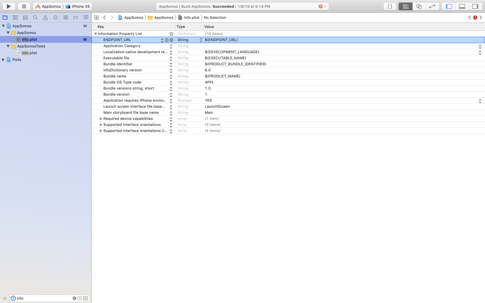

Environments Swift
===

## Desarrollo

1. Creamos la clase  Config que nos permitirá leer la variable $ENDPOINT_URL en el Plist:

```swift
import Foundation

class Config {
    
    static var endpoint: String  {
        get {
            
            if let path = Bundle.main.path(forResource: "Info", ofType: "plist") {
                if let dic = NSDictionary(contentsOfFile: path) {
                    return dic["ENDPOINT_URL"] as? String ?? String.Empty
                }
            }

            return String.Empty
        }
    }
}
```

2. Agregamos los ambientes (environments) que usaremos:

<p align="center">
	
</p>

<p align="center">
	
</p>

3. Agregamos las URLs bases correspondientes a cada ambiente:

<p align="center">
	
</p>

Le damos en <i>Add User-Defined Setting</i> y agregamos la variable <b> ENDPOINT_URL </b> nos autocompletara los <i>environments</i> previamente asignados.

<p align="center">
	
</p>

Ahora vamos acompletando las URLs Base correspondientes:

<p align="center">
	
</p>

#### 4. Sólo queda agregar una variable que nos permita leerla desde un archivo simple para el programador (Info.plist) y que haga referencía a la variable <i> ENDPOINT_URL </i> del <i>Build Settings</i>.

<p align="center">
	
</p>

#### 5. Ahora sólo queda leerla variable y usarla:

<p align="center">
	
</p>

La podemos cambiar desde:

<p align="center">
	
</p>

<p align="center">
	
</p>

y nos imprimirá la url correspondiente:

<p align="center">
	
</p>

Sólo falta construir una clase que nos permita unir las cadenas con la url base.

## Fuentes

* <a href="https://medium.com/@andersongusmao/xcode-targets-with-multiples-build-configuration-90a575ddc687">Building your app for a specific environment, i.e, development, testing or production</a>